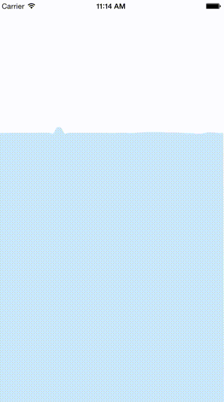

# RippleLayer

[](http://cocoapods.org/pods/RippleLayer)
[](http://cocoapods.org/pods/RippleLayer)
[](http://cocoapods.org/pods/RippleLayer)

## Overview

Draw splash effect using CGPath.

* Inspired [d-harel/raindrops](https://github.com/d-harel/raindrops).
* Original algorithm is (this article)[http://gamedevelopment.tutsplus.com/tutorials/make-a-splash-with-2d-water-effects--gamedev-236] by [http://tutsplus.com/authors/michael-hoffman](Michael Hoffman)




## Example

To run the example project, clone the repo, and run `pod install` from the Example directory first.

## Getting Started

### Installation

RippleLayer is available through [CocoaPods](http://cocoapods.org). To install
it, simply add the following line to your Podfile:

```ruby
pod "RippleLayer"
```

### Sample Usage

CALayer subclasses, have been RippleLayer to provide
You can be inserted anywhere in the UIView.

```Swift
class ViewController : UIViewController {
    override func viewDidLayoutSubviews() {
        super.viewDidLayoutSubviews()
        
        let rippleLayer = RippleLayer(
            size: myView.frame.size,
            numSprings: 320,
            random: true)
        rippleLayer.fillColor = UIColor(red: 204/255, green: 233/255, blue: 249/255, alpha: 1.0).CGColor
        myView.layer.addSublayer(rippleLayer)
   }
}
```

Make a UIView subclass if necessary.


### Advanced Usage

#### RippleLayer Init(size:numSprings:random:)

| name       | type    | description                                                 |
|:-----------|:--------|:----------------------------------------------------------- |
| size       | CGFloat | It will be drawn in this size, but sometimes Protrude by the height of the waves |
| numSprings | CGFlaot | Waves, are made with a large amount of Spring. We specify amount. |
| random     | Bool    | if true, random ripple  |

#### RippleLayer rippleAt(i:height:)

Ripple in any position

| name       | type    | description                                                 |
|:-----------|:--------|:----------------------------------------------------------- |
| i          | CGFloat | Ripple x position. Specify the index of spring. |
| height     | CGFlaot | Ripple height |

## Author

hadashiA, https://twitter.com/hadashiA

## License

RippleLayer is available under the MIT license. See the LICENSE file for more info.
